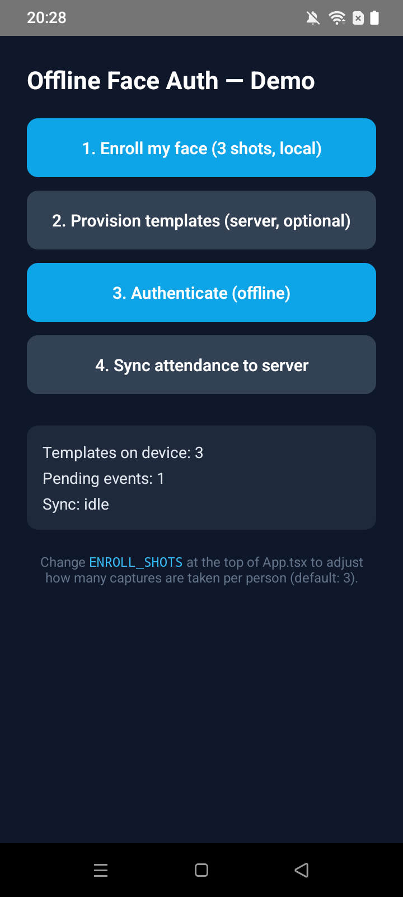
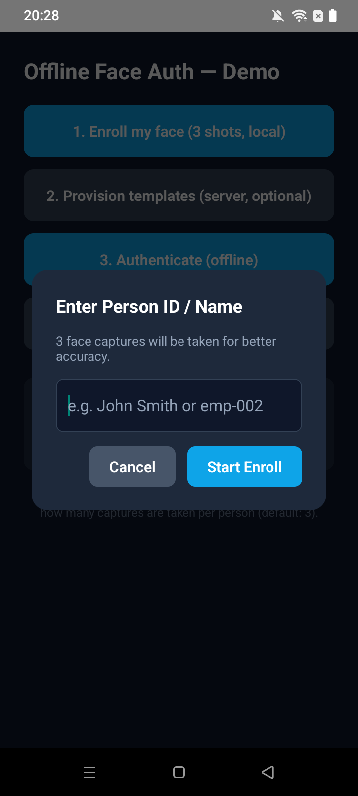

# react-native-offline-face-auth

Offline facial recognition + liveness detection for React Native, built for **field-personnel attendance** on mid-range phones. Fully on-device matching, open-source models, and an AWS **sync-and-purge** pipeline.


> **Keywords:** react-native face recognition · facial authentication · liveness detection · anti-spoofing · on-device ML · offline biometrics · TFLite · BlazeFace · FaceNet · MiniFASNet · face embedding · attendance tracking · field personnel · biometric authentication · edge ML · vision camera · encrypted storage · hardware security · AWS sync

---

## Features

- **Offline-first** — templates are provisioned from the server once, then all recognition and liveness runs with no network connection.
- **Hybrid liveness** — passive anti-spoof (MiniFASNet two-scale) on every frame plus a randomized active challenge (blink / smile / turn head) to defeat photo and screen-replay fraud.
- **No GPU required** — TFLite models on the XNNPACK CPU delegate; works on 3 GB Android / iOS 12+ devices.
- **Open-source only** — no proprietary SDKs, no per-seat license fees.
- **Hardware-backed security** — Android Keystore (StrongBox) / iOS Keychain (Secure Enclave); templates encrypted at rest; cancelable biohash transform; tamper-evident audit log.
- **< 10 MB model footprint** — all five TFLite models combined.
- **< 4 s end-to-end** — gate + active challenge + N-frame analysis + matching.

---

## Documentation

| Document | Description |
|----------|-------------|
| [logic.md](logic.md) | Architecture & pipeline walkthrough — every stage explained |
| [config.md](config.md) | Full configuration reference — all fields, thresholds, and tuning guidance |
| [CLAUDE.md](CLAUDE.md) | Contributor & AI guide — patterns, invariants, commands |
| [models/README.md](models/README.md) | Model provenance and licenses |

---

## Preview

| Home Screen | Enrollment Dialog | Camera / Face Guide |
|:-----------:|:-----------------:|:-------------------:|
|  |  |  |
| Main menu — templates enrolled, pending sync visible | "Enter Person ID / Name" before capture starts | Live camera + oval guide overlay · quality gate hint |

---

## Bundled Models

5 TFLite models ship inside the package. All run on the **CPU (XNNPACK delegate)** — no GPU required.

| # | Model | File | Size | License | Role in pipeline |
|---|-------|------|------|---------|-----------------|
| 1 | **BlazeFace** | `blazeface.tflite` | ~0.5 MB | Apache-2.0 | Face detection — bounding box + confidence, runs every frame |
| 2 | **Face Mesh** | `face_mesh.tflite` | ~3.0 MB | Apache-2.0 | 468 landmark points + head pose (yaw / pitch / roll) |
| 3 | **FaceNet-512** | `facenet_512.tflite` | ~4.0 MB | Apache-2.0 / MIT | 512-dimensional face embedding for identity matching |
| 4 | **MiniFASNet 2.7×** | `spoof_2_7.tflite` | ~1.0 MB | Apache-2.0 | Passive liveness — texture-scale spoof detection (prints, screens) |
| 5 | **MiniFASNet 4.0×** | `spoof_4_0.tflite` | ~1.0 MB | Apache-2.0 | Passive liveness — geometry-scale spoof detection (3D masks, replays) |
| | **Total** | | **~9.5 MB** | | |

**Pipeline role per model:**
- **BlazeFace** — lightweight, runs on every frame (~25 ms). Triggers the rest of the pipeline only when a face is detected.
- **Face Mesh** — heavier (~40 ms), only runs during `challenge` and `analyzing` stages to save CPU.
- **MiniFASNet ×2** — both branches run together during `analyzing`; their `live_score` outputs are averaged across 4 frames for a stable spoof decision.
- **FaceNet** — runs during `analyzing` to produce the probe embedding. L2-normalized 512-d vector enables fast cosine matching.

> SHA-256 digests for all five files are in [`models/manifest.json`](models/manifest.json) and verified on every `FaceAuth.init()` call when `readModelBytes` is supplied.

---

## Requirements

- React Native **≥ 0.72**, Android **8.0+ (API 26)**, iOS **12+**, **≥ 3 GB RAM**

**Peer dependencies:**

| Package | Version |
|---------|---------|
| `@react-native-async-storage/async-storage` | ≥ 1.21.0 |
| `@react-native-community/netinfo` | ≥ 11.0.0 |
| `axios` | ≥ 1.0.0 |
| `react` | ≥ 18.0.0 |
| `react-native` | ≥ 0.72.0 |
| `react-native-fast-tflite` | ≥ 1.3.0 |
| `react-native-keychain` | ≥ 8.1.0 |
| `react-native-vision-camera` | ≥ 4.0.0 |
| `react-native-worklets-core` | ≥ 1.3.0 |
| `vision-camera-resize-plugin` | ≥ 3.0.0 |

---

## Installation

```sh
npm install react-native-offline-face-auth \
  @react-native-async-storage/async-storage \
  @react-native-community/netinfo \
  axios \
  react-native-fast-tflite \
  react-native-keychain \
  react-native-vision-camera \
  react-native-worklets-core \
  vision-camera-resize-plugin

# iOS only
cd ios && pod install
```

**Model bundling:** copy the `.tflite` files from `node_modules/react-native-offline-face-auth/models/` into your app's assets and load them with `react-native-fast-tflite`'s `useTensorflowModel`.

**Permissions:** add `NSCameraUsageDescription` (iOS) and `CAMERA` (Android). Follow the `react-native-vision-camera` worklet setup guide.

---

## Quick Start

```tsx
import { FaceAuth, FaceAuthView } from 'react-native-offline-face-auth';
import { useTensorflowModel } from 'react-native-fast-tflite';

// 1. Initialize once at app startup
useEffect(() => {
  FaceAuth.init({
    awsSyncUrl:  'https://api.example.com/face-auth',
    deviceToken: 'your-device-token',
    deviceId:    'device-001',
  });
  // Pull enrolled templates while online
  FaceAuth.provision();
}, []);

// 2. Load TFLite models
const blazeface = useTensorflowModel(require('./models/blazeface.tflite'));
const faceMesh  = useTensorflowModel(require('./models/face_mesh.tflite'));
const facenet   = useTensorflowModel(require('./models/facenet_512.tflite'));
const spoof27   = useTensorflowModel(require('./models/spoof_2_7.tflite'));
const spoof40   = useTensorflowModel(require('./models/spoof_4_0.tflite'));

const models = { blazeface, faceMesh, embedding: facenet, liveness0: spoof27, liveness1: spoof40 };

// 3. Render the auth view — liveness, challenge, matching, and attendance logging are automatic
<FaceAuthView
  mode="identify"
  models={models}
  onResult={(r) => {
    if (r.ok) console.log('Authenticated:', r.personnelId, r.matchScore);
    else      console.log('Failed:', r.failureReason);
  }}
  onGuidance={(g) => setHint(g.message)}
/>

// 4. Manual sync (also fires automatically on network reconnect)
await FaceAuth.syncNow();
```

See [`example/App.tsx`](example/App.tsx) for a complete reference host app including enrollment, duplicate detection, and sync status display.

---

## API

### `FaceAuth` (static class)

| Method | Description |
|--------|-------------|
| `init(config)` | Open encrypted stores, derive the hardware key, verify model integrity, start the network watcher. |
| `isInitialized()` | Returns `true` after a successful `init`. |
| `provision({ full? })` | Pull enrolled templates from the server (incremental by default). No-op in offline-only mode. |
| `needsReprovision()` | `true` if templates were never synced or are older than `templateTtlMs`. |
| `enrollLocal(personnelId, embeddingB64s)` | Store face templates on-device — no server required. Pass base64 embeddings from `AuthResult.embeddingB64`. |
| `checkDuplicate(embeddingB64)` | Detect re-registration fraud before committing enrollment. Returns `{ isDuplicate, personnelId?, score }`. |
| `recordAttendance(result)` | Append a signed, hash-chained attendance event (auto-called by `FaceAuthView`). |
| `probeTransform(embedding)` | Apply the device's cancelable transform to a probe embedding. |
| `syncNow()` | Push queued attendance events to AWS; purge acknowledged rows. |
| `getPendingCount()` | Number of attendance events awaiting sync. |
| `getTemplateCount()` | Number of enrolled templates on-device. |
| `onSyncStatus(cb)` | Subscribe to `SyncStatus` updates; returns an unsubscribe function. |
| `dispose()` | Stop the network watcher and release resources. |

### Components

- **`<FaceAuthView mode models onResult onGuidance />`** — camera surface that runs a complete auth session.
- **`<FaceAuthModal ... />`** — modal wrapper around `FaceAuthView`.
- **`useFaceAuth({ mode, models, onResult })`** — headless hook (`start` / `cancel` / `feed`) for custom UIs.

### Configuration

Pass a `FaceAuthConfig` object to `FaceAuth.init()`. Key fields:

| Field | Default | Description |
|-------|---------|-------------|
| `awsSyncUrl` | — | AWS endpoint for sync. Omit for fully offline mode. |
| `deviceToken` | — | Per-device bearer token. Required with `awsSyncUrl`. |
| `deviceId` | `'unknown-device'` | Stamped onto every attendance event. |
| `thresholds` | see defaults | Override any subset of detection/liveness/matching thresholds. |
| `challenges` | all three | Pool for the random active challenge (`blink`, `smile`, `turn_head`). |
| `cancelableKey` | hardware key | Rotate to revoke all enrolled templates. |

Full reference: [config.md](config.md).

---

## Server Contract

| Endpoint | Request | Response |
|----------|---------|----------|
| `POST /provision` | `{ attestation, since }` | `{ mode:'full'\|'delta', templates/upserts/removals, thresholds?, manifest?, syncedAt }` |
| `POST /attendance` | `{ events: StoredEvent[] }` | `{ acked: string[] }` |

- `since` = `lastProvisionedAt` (0 for first/forced-full sync).
- `embedding` values are base64 little-endian float32 from the **same** MobileFaceNet model + preprocessing as the device.
- `thresholds` in the provision response overrides local config remotely.
- `manifest` is the signed model manifest cached for the next boot integrity check.
- Only acknowledged attendance events are purged locally; the server must deduplicate on event `id`.

A zero-dependency mock backend is in [`server/index.js`](server/index.js) (port 8080).

---

## Security

| Property | Mechanism |
|----------|-----------|
| No raw images on disk | Only 512-d embeddings stored |
| Hardware-backed encryption key | Android Keystore (StrongBox) / iOS Keychain (Secure Enclave) |
| Encrypted at rest | HMAC-SHA256 keystream cipher per entry |
| Revocable templates | Cancelable biohash — rotate key to revoke all |
| Tamper-evident log | SHA-256 hash chain + HMAC signature per event |
| Model integrity | SHA-256 of every `.tflite` verified on boot |
| Passive anti-spoof | MiniFASNet two-scale (texture + geometry attacks) |
| Active anti-spoof | Randomized blink / smile / turn challenge |

---

## License

MIT. Bundled TFLite models are Apache-2.0 / MIT — see [`models/README.md`](models/README.md) for provenance and per-model licenses.
